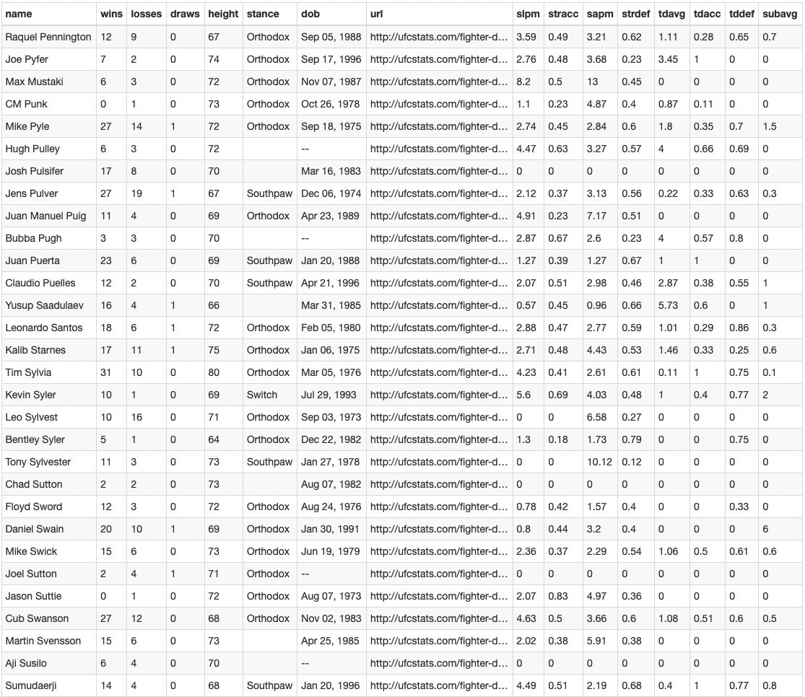

# UFC Stats Data Collector

Several Pythons scripts used to retrieve data from the [UFC Stats website](http://www.ufcstats.com) and store the data in an sqlite database.

# Database
The image below shows the event table in the database

The image below shows the fighter table in the database

